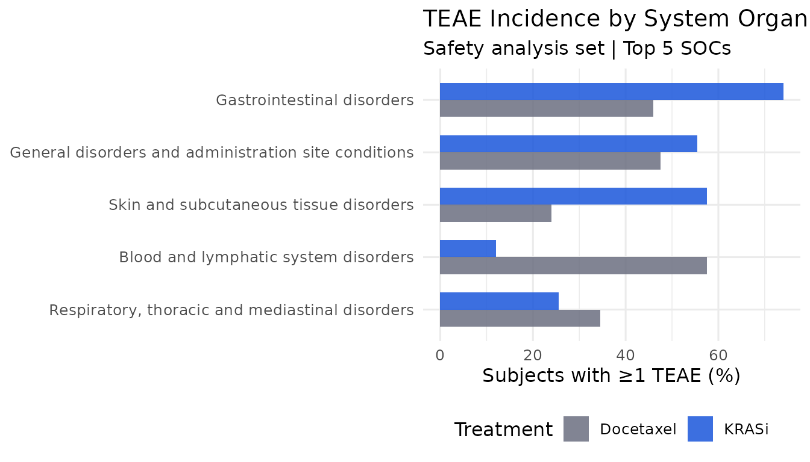
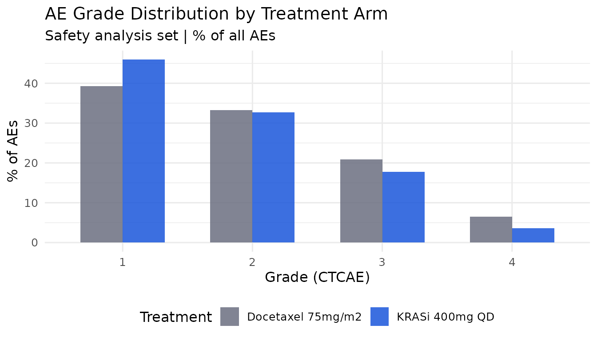

# Audit-ready oncology safety monitoring with regulog

## Overview

Oncology safety monitoring is one of the highest-scrutiny activities in
clinical development. Every data cut decision, every SAE narrative,
every judgment about treatment-relatedness, and every action taken in
response to a safety signal must be traceable, documented, and available
for inspection.

In practice, safety monitoring produces a trail of emails, meeting
minutes, and retrospective notes that is difficult to assemble and
impossible to cryptographically verify. `regulog` replaces this with a
hash-chained audit trail that is built as the analysis runs — not
reconstructed after the fact.

This article walks through a complete safety monitoring workflow for a
simulated Phase III non-small cell lung cancer (NSCLC) trial, covering
TEAE summaries, Grade 3+ adverse event analysis, SAE flagging, safety
signal documentation, dual medical/statistical sign-off, and
submission-ready audit trail export.

------------------------------------------------------------------------

## Setup

``` r

library(regulog)
library(dplyr)
```

    #> 
    #> Attaching package: 'dplyr'

    #> The following objects are masked from 'package:stats':
    #> 
    #>     filter, lag

    #> The following objects are masked from 'package:base':
    #> 
    #>     intersect, setdiff, setequal, union

``` r

library(tidyr)
library(ggplot2)
```

------------------------------------------------------------------------

## Simulate the safety datasets

We simulate CDISC ADaM-structured ADSL and ADAE datasets for a Phase III
trial of a novel KRAS G12C inhibitor versus docetaxel in second-line
NSCLC. 400 randomised patients, 200 per arm.

``` r

n_per_arm <- 200L
n_total <- n_per_arm * 2L

# ── ADSL ──────────────────────────────────────────────────────────────────
adsl <- data.frame(
  STUDYID = "NSCLC-KRASi-301",
  USUBJID = sprintf("KRASi301-%04d", seq_len(n_total)),
  TRT01P = rep(c("KRASi 400mg QD", "Docetaxel 75mg/m2"), each = n_per_arm),
  TRT01PN = rep(c(1L, 2L), each = n_per_arm),
  AGE = round(rnorm(n_total, mean = 63, sd = 9)),
  SEX = sample(c("M", "F"), n_total, replace = TRUE, prob = c(0.52, 0.48)),
  ITTFL = "Y",
  SAFFL = "Y",
  EOSSTT = sample(c("COMPLETED", "DISCONTINUED", "ONGOING"),
    n_total,
    replace = TRUE, prob = c(0.35, 0.45, 0.20)
  ),
  stringsAsFactors = FALSE
)

# ── Adverse event system organ classes ────────────────────────────────────
socs <- c(
  "Gastrointestinal disorders",
  "General disorders and administration site conditions",
  "Skin and subcutaneous tissue disorders",
  "Respiratory, thoracic and mediastinal disorders",
  "Metabolism and nutrition disorders",
  "Blood and lymphatic system disorders",
  "Nervous system disorders",
  "Infections and infestations"
)

ae_terms <- list(
  "Gastrointestinal disorders" = c("Nausea", "Diarrhoea", "Vomiting", "Constipation"),
  "General disorders and administration site conditions" = c("Fatigue", "Pyrexia", "Oedema peripheral"),
  "Skin and subcutaneous tissue disorders" = c("Rash", "Pruritus", "Dry skin"),
  "Respiratory, thoracic and mediastinal disorders" = c("Cough", "Dyspnoea", "Pneumonitis"),
  "Metabolism and nutrition disorders" = c("Decreased appetite", "Hyponatraemia", "Hyperglycaemia"),
  "Blood and lymphatic system disorders" = c("Anaemia", "Neutropenia", "Thrombocytopenia"),
  "Nervous system disorders" = c("Headache", "Peripheral neuropathy", "Dizziness"),
  "Infections and infestations" = c("Upper respiratory tract infection", "Pneumonia")
)

# Simulate AEs — KRASi has more GI/skin; docetaxel has more haematologic
set.seed(2026)
adae_list <- lapply(seq_len(n_total), function(i) {
  subj <- adsl$USUBJID[i]
  trt <- adsl$TRT01P[i]
  is_krasi <- trt == "KRASi 400mg QD"

  n_ae <- rpois(1, lambda = if (is_krasi) 4.2 else 3.8)
  if (n_ae == 0L) {
    return(NULL)
  }

  soc_weights <- if (is_krasi) {
    c(0.30, 0.18, 0.20, 0.08, 0.08, 0.04, 0.06, 0.06)
  } else {
    c(0.18, 0.16, 0.06, 0.10, 0.10, 0.22, 0.08, 0.10)
  }

  sampled_socs <- sample(socs, n_ae, replace = TRUE, prob = soc_weights)

  aes <- do.call(rbind, lapply(seq_along(sampled_socs), function(j) {
    soc <- sampled_socs[j]
    term <- sample(ae_terms[[soc]], 1L)

    grade_probs <- if (is_krasi && soc == "Blood and lymphatic system disorders") {
      c(0.4, 0.35, 0.20, 0.05)
    } else if (!is_krasi && soc == "Blood and lymphatic system disorders") {
      c(0.2, 0.30, 0.35, 0.15)
    } else {
      c(0.45, 0.35, 0.16, 0.04)
    }
    grade <- sample(1:4, 1L, prob = grade_probs)

    data.frame(
      STUDYID = "NSCLC-KRASi-301",
      USUBJID = subj,
      TRT01P = trt,
      AEBODSYS = soc,
      AEDECOD = term,
      AESEV = c("MILD", "MODERATE", "SEVERE", "LIFE-THREATENING")[grade],
      AETOXGR = as.character(grade),
      AESER = ifelse(grade >= 3 & runif(1) < 0.35, "Y", "N"),
      AEREL = sample(c("RELATED", "NOT RELATED", "POSSIBLY RELATED"),
        1L,
        prob = c(0.5, 0.25, 0.25)
      ),
      AEACN = ifelse(grade >= 3,
        sample(c("DOSE REDUCED", "DRUG WITHDRAWN", "DOSE NOT CHANGED"),
          1L,
          prob = c(0.4, 0.3, 0.3)
        ),
        "DOSE NOT CHANGED"
      ),
      AESTDY = sample(1:365, 1L),
      stringsAsFactors = FALSE
    )
  }))
  aes
})

adae <- do.call(rbind, Filter(Negate(is.null), adae_list))
adae <- adae[order(adae$USUBJID, adae$AESTDY), ]
rownames(adae) <- NULL

cat(sprintf(
  "ADSL: %d subjects | ADAE: %d AEs across %d subjects\n",
  nrow(adsl),
  nrow(adae),
  n_distinct(adae$USUBJID)
))
```

    #> ADSL: 400 subjects | ADAE: 1597 AEs across 394 subjects

``` r

# Write to disk so rl_read()/with_log() have real files to read
tmp_adsl <- tempfile(fileext = ".csv")
tmp_adae <- tempfile(fileext = ".csv")
write.csv(adsl, tmp_adsl, row.names = FALSE)
write.csv(adae, tmp_adae, row.names = FALSE)
```

------------------------------------------------------------------------

## Open the safety monitoring session

[`regulog_init()`](https://reprostats.org/regulog/reference/regulog_init.md)
creates the session and writes the genesis record immediately. The data
cut and protocol context are captured as the first logged note, since
they are study metadata rather than session configuration.

``` r

log <- regulog_init(
  app     = "NSCLC-KRASi-301-safety-summary",
  version = "1.0.0",
  user    = "jsmith",
  path    = file.path(tempdir(), "audit_KRASi301_safety_v1.rlog")
)

log_note(
  log,
  "Scheduled safety data cut for Safety Monitoring Committee (SMC) review.
   Protocol: NSCLC-KRASi-301. Data cut: 2026-05-15. Analysis set: safety
   analysis set (SAFFL = Y). SMC meeting: 2026-07-10. Regulatory basis:
   21 CFR Part 11, ICH E6(R2)."
)
```

    #> regulog: note logged

``` r

log
```

    #> <regulog>
    #>   App:     NSCLC-KRASi-301-safety-summary v1.0.0
    #>   User:    jsmith
    #>   Entries: 1
    #>   Path:    /tmp/RtmpdqfTgX/audit_KRASi301_safety_v1.rlog

------------------------------------------------------------------------

## Log data access and the data cut

Loading ADSL and ADAE is logged automatically with
[`with_log()`](https://reprostats.org/regulog/reference/with_log.md) —
row and column counts are captured at the moment of read, not
reconstructed afterwards.

``` r

with_log(log, {
  adsl_loaded <- read(read.csv, tmp_adsl)
  adae_loaded <- read(read.csv, tmp_adae)
})

# Document the data cut — a critical audit point in any safety review
log_note(
  log,
  "Data cut date confirmed as 2026-05-15 per DMC charter Section 4.2.
   All AEs with onset on or before 2026-05-15 included.
   Lock confirmed by DM team (ref: DM-lock-20260518-001)."
)
```

    #> regulog: note logged

------------------------------------------------------------------------

## Apply safety analysis population

``` r

adsl_saf <- adsl |> filter(SAFFL == "Y")
adae_saf <- adae |> filter(USUBJID %in% adsl_saf$USUBJID)

arm_n <- adsl_saf |> count(TRT01P)

log_action(log,
  action = "define_safety_set",
  object = "NSCLC-KRASi-301 safety analysis set",
  reason = sprintf(
    "Applied safety analysis set (SAFFL = Y) per SAP Section 4.1. %s",
    paste(sprintf("%s: n = %d", arm_n$TRT01P, arm_n$n), collapse = " | ")
  )
)
```

    #> regulog: logged action 'define_safety_set' on 'NSCLC-KRASi-301 safety analysis set'

------------------------------------------------------------------------

## TEAE incidence summary

``` r

teae_summary <- adae_saf |>
  group_by(TRT01P, AEBODSYS) |>
  summarise(
    n_subjects = n_distinct(USUBJID),
    n_events   = n(),
    .groups    = "drop"
  ) |>
  left_join(arm_n, by = "TRT01P") |>
  mutate(pct = round(n_subjects / n * 100, 1)) |>
  arrange(AEBODSYS, TRT01P)

log_action(log,
  action = "compute_teae_incidence",
  object = "TEAE incidence table by SOC",
  reason = sprintf(
    "Computed per SAP Section 6.1. TEAEs reported: %d subjects in KRASi arm (%.1f%%), %d in docetaxel arm (%.1f%%)",
    teae_summary$n_subjects[teae_summary$TRT01P == "KRASi 400mg QD"] |> max(),
    teae_summary$pct[teae_summary$TRT01P == "KRASi 400mg QD"] |> max(),
    teae_summary$n_subjects[teae_summary$TRT01P == "Docetaxel 75mg/m2"] |> max(),
    teae_summary$pct[teae_summary$TRT01P == "Docetaxel 75mg/m2"] |> max()
  )
)
```

    #> regulog: logged action 'compute_teae_incidence' on 'TEAE incidence table by SOC'

``` r

top_socs <- teae_summary |>
  group_by(AEBODSYS) |>
  summarise(total = sum(n_subjects)) |>
  slice_max(total, n = 5L) |>
  pull(AEBODSYS)

teae_summary |>
  filter(AEBODSYS %in% top_socs) |>
  select(
    SOC = AEBODSYS, Treatment = TRT01P,
    `N subjects` = n_subjects, `%` = pct
  ) |>
  knitr::kable(caption = "TEAE incidence by SOC — top 5 (safety analysis set)")
```

| SOC | Treatment | N subjects | % |
|:---|:---|---:|---:|
| Blood and lymphatic system disorders | Docetaxel 75mg/m2 | 115 | 57.5 |
| Blood and lymphatic system disorders | KRASi 400mg QD | 24 | 12.0 |
| Gastrointestinal disorders | Docetaxel 75mg/m2 | 92 | 46.0 |
| Gastrointestinal disorders | KRASi 400mg QD | 148 | 74.0 |
| General disorders and administration site conditions | Docetaxel 75mg/m2 | 95 | 47.5 |
| General disorders and administration site conditions | KRASi 400mg QD | 111 | 55.5 |
| Respiratory, thoracic and mediastinal disorders | Docetaxel 75mg/m2 | 69 | 34.5 |
| Respiratory, thoracic and mediastinal disorders | KRASi 400mg QD | 51 | 25.5 |
| Skin and subcutaneous tissue disorders | Docetaxel 75mg/m2 | 48 | 24.0 |
| Skin and subcutaneous tissue disorders | KRASi 400mg QD | 115 | 57.5 |

TEAE incidence by SOC — top 5 (safety analysis set) {.table}

------------------------------------------------------------------------

## Grade 3/4 adverse events

``` r

g34 <- adae_saf |>
  filter(AETOXGR %in% c("3", "4")) |>
  group_by(TRT01P, AEBODSYS, AEDECOD, AETOXGR) |>
  summarise(n = n_distinct(USUBJID), .groups = "drop") |>
  left_join(arm_n |> rename(arm_total = n), by = "TRT01P") |>
  mutate(pct = round(n / arm_total * 100, 1)) |>
  arrange(desc(n))

log_action(log,
  action = "compute_grade34_ae",
  object = "Grade 3/4 TEAE table",
  reason = sprintf(
    "Computed per SAP Section 6.2 and ICH E9. Grade 3/4 AEs: %d events in KRASi arm, %d in docetaxel arm",
    nrow(adae_saf[adae_saf$TRT01P == "KRASi 400mg QD" &
      adae_saf$AETOXGR %in% c("3", "4"), ]),
    nrow(adae_saf[adae_saf$TRT01P == "Docetaxel 75mg/m2" &
      adae_saf$AETOXGR %in% c("3", "4"), ])
  )
)
```

    #> regulog: logged action 'compute_grade34_ae' on 'Grade 3/4 TEAE table'

``` r

g34 |>
  select(
    Treatment = TRT01P, SOC = AEBODSYS,
    Term = AEDECOD, Grade = AETOXGR,
    `N subjects` = n, `%` = pct
  ) |>
  head(12L) |>
  knitr::kable(caption = "Grade 3/4 TEAEs — top 12 (safety analysis set)")
```

| Treatment | SOC | Term | Grade | N subjects | % |
|:---|:---|:---|:---|---:|---:|
| Docetaxel 75mg/m2 | Blood and lymphatic system disorders | Anaemia | 3 | 21 | 10.5 |
| Docetaxel 75mg/m2 | Blood and lymphatic system disorders | Thrombocytopenia | 3 | 19 | 9.5 |
| Docetaxel 75mg/m2 | Blood and lymphatic system disorders | Neutropenia | 3 | 14 | 7.0 |
| KRASi 400mg QD | Gastrointestinal disorders | Constipation | 3 | 14 | 7.0 |
| KRASi 400mg QD | Gastrointestinal disorders | Nausea | 3 | 14 | 7.0 |
| KRASi 400mg QD | General disorders and administration site conditions | Fatigue | 3 | 12 | 6.0 |
| KRASi 400mg QD | Skin and subcutaneous tissue disorders | Rash | 3 | 11 | 5.5 |
| Docetaxel 75mg/m2 | Infections and infestations | Pneumonia | 3 | 10 | 5.0 |
| KRASi 400mg QD | Skin and subcutaneous tissue disorders | Pruritus | 3 | 10 | 5.0 |
| Docetaxel 75mg/m2 | Blood and lymphatic system disorders | Neutropenia | 4 | 9 | 4.5 |
| KRASi 400mg QD | Skin and subcutaneous tissue disorders | Dry skin | 3 | 9 | 4.5 |
| Docetaxel 75mg/m2 | Blood and lymphatic system disorders | Anaemia | 4 | 8 | 4.0 |

Grade 3/4 TEAEs — top 12 (safety analysis set) {.table}

------------------------------------------------------------------------

## Serious adverse events

``` r

saes <- adae_saf |>
  filter(AESER == "Y") |>
  group_by(TRT01P, AEBODSYS, AEDECOD) |>
  summarise(n = n_distinct(USUBJID), .groups = "drop") |>
  left_join(arm_n |> rename(arm_total = n), by = "TRT01P") |>
  mutate(pct = round(n / arm_total * 100, 1)) |>
  arrange(desc(n))

n_sae_krasi <- n_distinct(
  adae_saf$USUBJID[adae_saf$AESER == "Y" & adae_saf$TRT01P == "KRASi 400mg QD"]
)
n_sae_doce <- n_distinct(
  adae_saf$USUBJID[adae_saf$AESER == "Y" & adae_saf$TRT01P == "Docetaxel 75mg/m2"]
)

log_action(log,
  action = "compute_sae_summary",
  object = "SAE summary table",
  reason = sprintf(
    "Summarised per SAP Section 6.3. SAEs: %d subjects in KRASi arm (%.1f%%), %d in docetaxel arm (%.1f%%)",
    n_sae_krasi,
    n_sae_krasi / n_per_arm * 100,
    n_sae_doce,
    n_sae_doce / n_per_arm * 100
  )
)
```

    #> regulog: logged action 'compute_sae_summary' on 'SAE summary table'

``` r

saes |>
  select(Treatment = TRT01P, SOC = AEBODSYS, Term = AEDECOD, `N subjects` = n) |>
  head(10L) |>
  knitr::kable(caption = "Serious TEAEs (AESER = Y) — top 10")
```

| Treatment | SOC | Term | N subjects |
|:---|:---|:---|---:|
| Docetaxel 75mg/m2 | Blood and lymphatic system disorders | Thrombocytopenia | 13 |
| Docetaxel 75mg/m2 | Blood and lymphatic system disorders | Anaemia | 9 |
| Docetaxel 75mg/m2 | Blood and lymphatic system disorders | Neutropenia | 9 |
| KRASi 400mg QD | Gastrointestinal disorders | Nausea | 7 |
| KRASi 400mg QD | Skin and subcutaneous tissue disorders | Pruritus | 7 |
| KRASi 400mg QD | Gastrointestinal disorders | Constipation | 6 |
| Docetaxel 75mg/m2 | Gastrointestinal disorders | Nausea | 5 |
| Docetaxel 75mg/m2 | Infections and infestations | Upper respiratory tract infection | 5 |
| KRASi 400mg QD | Skin and subcutaneous tissue disorders | Rash | 5 |
| Docetaxel 75mg/m2 | General disorders and administration site conditions | Pyrexia | 4 |

Serious TEAEs (AESER = Y) — top 10 {.table}

------------------------------------------------------------------------

## Pneumonitis signal review

Pneumonitis is a clinically important immune-mediated AE associated with
KRAS inhibitors. We identify cases and document the medical review
decision — three separate, individually logged steps that together form
a single audit narrative.

``` r

pneumonitis <- adae_saf |>
  filter(grepl("Pneumonitis", AEDECOD, ignore.case = TRUE))

n_pneu_krasi <- nrow(pneumonitis[pneumonitis$TRT01P == "KRASi 400mg QD", ])
n_pneu_doce <- nrow(pneumonitis[pneumonitis$TRT01P == "Docetaxel 75mg/m2", ])
n_pneu_g3 <- nrow(pneumonitis[pneumonitis$AETOXGR %in% c("3", "4"), ])

log_note(
  log,
  sprintf(
    "Safety signal identified: pneumonitis — %d cases in KRASi arm vs %d in
     docetaxel arm. Grade 3/4: %d cases. Flagged for medical monitor review
     per Safety Review Plan.",
    n_pneu_krasi, n_pneu_doce, n_pneu_g3
  )
)
```

    #> regulog: note logged

``` r

# Log individual Grade 3+ pneumonitis cases
g3_pneu <- pneumonitis |> filter(AETOXGR %in% c("3", "4"))
for (i in seq_len(nrow(g3_pneu))) {
  log_note(
    log,
    sprintf(
      "Pneumonitis case — USUBJID %s | Grade %s | Treatment: %s | Action: %s | Related: %s",
      g3_pneu$USUBJID[i], g3_pneu$AETOXGR[i],
      g3_pneu$TRT01P[i], g3_pneu$AEACN[i], g3_pneu$AEREL[i]
    )
  )
}
```

    #> regulog: note logged
    #> regulog: note logged
    #> regulog: note logged
    #> regulog: note logged
    #> regulog: note logged
    #> regulog: note logged

``` r

# Log medical monitor decision
log_note(
  log,
  sprintf(
    "Medical monitor reviewed all %d pneumonitis cases (ref:
     MM-review-20260620-001). Conclusion: incidence consistent with class
     effect; benefit-risk remains favourable. Risk mitigation: enhanced
     monitoring protocol added to IB (v4.2, dated 2026-06-22). No protocol
     amendment required at this time.",
    n_pneu_krasi
  )
)
```

    #> regulog: note logged

``` r

pneumonitis |>
  select(USUBJID,
    Treatment = TRT01P, Term = AEDECOD,
    Grade = AETOXGR, Serious = AESER,
    Related = AEREL, Action = AEACN
  ) |>
  knitr::kable(caption = "Pneumonitis cases — all grades")
```

| USUBJID | Treatment | Term | Grade | Serious | Related | Action |
|:---|:---|:---|:---|:---|:---|:---|
| KRASi301-0032 | KRASi 400mg QD | Pneumonitis | 3 | N | RELATED | DOSE NOT CHANGED |
| KRASi301-0040 | KRASi 400mg QD | Pneumonitis | 2 | N | POSSIBLY RELATED | DOSE NOT CHANGED |
| KRASi301-0044 | KRASi 400mg QD | Pneumonitis | 1 | N | POSSIBLY RELATED | DOSE NOT CHANGED |
| KRASi301-0059 | KRASi 400mg QD | Pneumonitis | 2 | N | NOT RELATED | DOSE NOT CHANGED |
| KRASi301-0067 | KRASi 400mg QD | Pneumonitis | 1 | N | NOT RELATED | DOSE NOT CHANGED |
| KRASi301-0099 | KRASi 400mg QD | Pneumonitis | 1 | N | NOT RELATED | DOSE NOT CHANGED |
| KRASi301-0101 | KRASi 400mg QD | Pneumonitis | 2 | N | RELATED | DOSE NOT CHANGED |
| KRASi301-0151 | KRASi 400mg QD | Pneumonitis | 1 | N | RELATED | DOSE NOT CHANGED |
| KRASi301-0160 | KRASi 400mg QD | Pneumonitis | 1 | N | NOT RELATED | DOSE NOT CHANGED |
| KRASi301-0161 | KRASi 400mg QD | Pneumonitis | 1 | N | RELATED | DOSE NOT CHANGED |
| KRASi301-0170 | KRASi 400mg QD | Pneumonitis | 2 | N | RELATED | DOSE NOT CHANGED |
| KRASi301-0176 | KRASi 400mg QD | Pneumonitis | 4 | N | RELATED | DRUG WITHDRAWN |
| KRASi301-0178 | KRASi 400mg QD | Pneumonitis | 4 | Y | RELATED | DRUG WITHDRAWN |
| KRASi301-0186 | KRASi 400mg QD | Pneumonitis | 1 | N | RELATED | DOSE NOT CHANGED |
| KRASi301-0200 | KRASi 400mg QD | Pneumonitis | 2 | N | RELATED | DOSE NOT CHANGED |
| KRASi301-0206 | Docetaxel 75mg/m2 | Pneumonitis | 1 | N | RELATED | DOSE NOT CHANGED |
| KRASi301-0207 | Docetaxel 75mg/m2 | Pneumonitis | 1 | N | RELATED | DOSE NOT CHANGED |
| KRASi301-0216 | Docetaxel 75mg/m2 | Pneumonitis | 3 | N | POSSIBLY RELATED | DOSE REDUCED |
| KRASi301-0228 | Docetaxel 75mg/m2 | Pneumonitis | 1 | N | POSSIBLY RELATED | DOSE NOT CHANGED |
| KRASi301-0234 | Docetaxel 75mg/m2 | Pneumonitis | 2 | N | RELATED | DOSE NOT CHANGED |
| KRASi301-0239 | Docetaxel 75mg/m2 | Pneumonitis | 1 | N | NOT RELATED | DOSE NOT CHANGED |
| KRASi301-0241 | Docetaxel 75mg/m2 | Pneumonitis | 2 | N | NOT RELATED | DOSE NOT CHANGED |
| KRASi301-0244 | Docetaxel 75mg/m2 | Pneumonitis | 2 | N | NOT RELATED | DOSE NOT CHANGED |
| KRASi301-0247 | Docetaxel 75mg/m2 | Pneumonitis | 2 | N | RELATED | DOSE NOT CHANGED |
| KRASi301-0248 | Docetaxel 75mg/m2 | Pneumonitis | 1 | N | RELATED | DOSE NOT CHANGED |
| KRASi301-0268 | Docetaxel 75mg/m2 | Pneumonitis | 1 | N | NOT RELATED | DOSE NOT CHANGED |
| KRASi301-0272 | Docetaxel 75mg/m2 | Pneumonitis | 2 | N | POSSIBLY RELATED | DOSE NOT CHANGED |
| KRASi301-0279 | Docetaxel 75mg/m2 | Pneumonitis | 2 | N | RELATED | DOSE NOT CHANGED |
| KRASi301-0289 | Docetaxel 75mg/m2 | Pneumonitis | 1 | N | RELATED | DOSE NOT CHANGED |
| KRASi301-0300 | Docetaxel 75mg/m2 | Pneumonitis | 1 | N | RELATED | DOSE NOT CHANGED |
| KRASi301-0305 | Docetaxel 75mg/m2 | Pneumonitis | 1 | N | RELATED | DOSE NOT CHANGED |
| KRASi301-0312 | Docetaxel 75mg/m2 | Pneumonitis | 1 | N | POSSIBLY RELATED | DOSE NOT CHANGED |
| KRASi301-0316 | Docetaxel 75mg/m2 | Pneumonitis | 2 | N | RELATED | DOSE NOT CHANGED |
| KRASi301-0320 | Docetaxel 75mg/m2 | Pneumonitis | 1 | N | NOT RELATED | DOSE NOT CHANGED |
| KRASi301-0326 | Docetaxel 75mg/m2 | Pneumonitis | 2 | N | RELATED | DOSE NOT CHANGED |
| KRASi301-0358 | Docetaxel 75mg/m2 | Pneumonitis | 2 | N | RELATED | DOSE NOT CHANGED |
| KRASi301-0367 | Docetaxel 75mg/m2 | Pneumonitis | 1 | N | RELATED | DOSE NOT CHANGED |
| KRASi301-0370 | Docetaxel 75mg/m2 | Pneumonitis | 1 | N | POSSIBLY RELATED | DOSE NOT CHANGED |
| KRASi301-0373 | Docetaxel 75mg/m2 | Pneumonitis | 3 | N | POSSIBLY RELATED | DOSE REDUCED |
| KRASi301-0379 | Docetaxel 75mg/m2 | Pneumonitis | 1 | N | POSSIBLY RELATED | DOSE NOT CHANGED |
| KRASi301-0385 | Docetaxel 75mg/m2 | Pneumonitis | 1 | N | POSSIBLY RELATED | DOSE NOT CHANGED |
| KRASi301-0392 | Docetaxel 75mg/m2 | Pneumonitis | 3 | Y | POSSIBLY RELATED | DOSE NOT CHANGED |
| KRASi301-0395 | Docetaxel 75mg/m2 | Pneumonitis | 2 | N | RELATED | DOSE NOT CHANGED |

Pneumonitis cases — all grades {.table style="width:100%;"}

------------------------------------------------------------------------

## Discontinuations due to AEs

``` r

disc_ae <- adae_saf |>
  filter(AEACN == "DRUG WITHDRAWN") |>
  group_by(TRT01P, AEBODSYS, AEDECOD) |>
  summarise(n = n_distinct(USUBJID), .groups = "drop") |>
  arrange(desc(n))

n_disc_krasi <- n_distinct(
  adae_saf$USUBJID[adae_saf$AEACN == "DRUG WITHDRAWN" &
    adae_saf$TRT01P == "KRASi 400mg QD"]
)
n_disc_doce <- n_distinct(
  adae_saf$USUBJID[adae_saf$AEACN == "DRUG WITHDRAWN" &
    adae_saf$TRT01P == "Docetaxel 75mg/m2"]
)

log_action(log,
  action = "compute_disc_due_to_ae",
  object = "Discontinuation due to AE table",
  reason = sprintf(
    "Tabulated per SAP Section 6.4. Discontinued due to AE: %d subjects in KRASi arm (%.1f%%), %d in docetaxel (%.1f%%)",
    n_disc_krasi, n_disc_krasi / n_per_arm * 100,
    n_disc_doce,  n_disc_doce / n_per_arm * 100
  )
)
```

    #> regulog: logged action 'compute_disc_due_to_ae' on 'Discontinuation due to AE table'

``` r

disc_ae |>
  select(
    Treatment = TRT01P, SOC = AEBODSYS,
    Term = AEDECOD, `N subjects` = n
  ) |>
  head(10L) |>
  knitr::kable(caption = "Discontinuations due to AE — top 10")
```

| Treatment | SOC | Term | N subjects |
|:---|:---|:---|---:|
| Docetaxel 75mg/m2 | Blood and lymphatic system disorders | Anaemia | 14 |
| Docetaxel 75mg/m2 | Blood and lymphatic system disorders | Thrombocytopenia | 9 |
| Docetaxel 75mg/m2 | Blood and lymphatic system disorders | Neutropenia | 5 |
| KRASi 400mg QD | Gastrointestinal disorders | Constipation | 5 |
| KRASi 400mg QD | Skin and subcutaneous tissue disorders | Rash | 5 |
| Docetaxel 75mg/m2 | Infections and infestations | Pneumonia | 4 |
| Docetaxel 75mg/m2 | Infections and infestations | Upper respiratory tract infection | 4 |
| KRASi 400mg QD | Gastrointestinal disorders | Diarrhoea | 4 |
| KRASi 400mg QD | General disorders and administration site conditions | Fatigue | 4 |
| KRASi 400mg QD | Metabolism and nutrition disorders | Hyperglycaemia | 4 |

Discontinuations due to AE — top 10 {.table}

------------------------------------------------------------------------

## Safety visualisations

``` r

teae_wide <- teae_summary |>
  filter(AEBODSYS %in% top_socs) |>
  select(TRT01P, AEBODSYS, pct) |>
  pivot_wider(names_from = TRT01P, values_from = pct, values_fill = 0) |>
  rename(KRASi = `KRASi 400mg QD`, Docetaxel = `Docetaxel 75mg/m2`)

teae_wide |>
  tidyr::pivot_longer(
    cols = c(KRASi, Docetaxel),
    names_to = "Treatment", values_to = "pct"
  ) |>
  ggplot(aes(x = pct, y = reorder(AEBODSYS, pct), fill = Treatment)) +
  geom_col(position = "dodge", width = 0.65, alpha = 0.85) +
  scale_fill_manual(values = c("KRASi" = "#1a56db", "Docetaxel" = "#6b6f80")) +
  labs(
    title    = "TEAE Incidence by System Organ Class",
    subtitle = "Safety analysis set | Top 5 SOCs",
    x        = "Subjects with ≥1 TEAE (%)",
    y        = NULL,
    fill     = "Treatment"
  ) +
  theme_minimal(base_size = 12) +
  theme(legend.position = "bottom")
```



``` r

log_note(log, "Figure generated: TEAE incidence by SOC (top 5), dodge bar chart")
```

    #> regulog: note logged

``` r

adae_saf |>
  count(TRT01P, AETOXGR) |>
  group_by(TRT01P) |>
  mutate(pct = n / sum(n) * 100) |>
  ggplot(aes(x = AETOXGR, y = pct, fill = TRT01P)) +
  geom_col(position = "dodge", width = 0.65, alpha = 0.85) +
  scale_fill_manual(values = c(
    "KRASi 400mg QD" = "#1a56db",
    "Docetaxel 75mg/m2" = "#6b6f80"
  )) +
  labs(
    title    = "AE Grade Distribution by Treatment Arm",
    subtitle = "Safety analysis set | % of all AEs",
    x        = "Grade (CTCAE)",
    y        = "% of AEs",
    fill     = "Treatment"
  ) +
  theme_minimal(base_size = 12) +
  theme(legend.position = "bottom")
```



``` r

log_note(log, "Figure generated: AE grade distribution by treatment arm")
```

    #> regulog: note logged

------------------------------------------------------------------------

## Safety summary for SMC

``` r

smc_table <- data.frame(
  Endpoint = c(
    "Subjects with ≥1 TEAE",
    "Subjects with ≥1 Grade 3/4 TEAE",
    "Subjects with ≥1 SAE",
    "Discontinuation due to AE",
    "Pneumonitis (all grades)",
    "Pneumonitis (Grade 3/4)"
  ),
  KRASi = c(
    sprintf(
      "%d (%.1f%%)", n_distinct(adae_saf$USUBJID[adae_saf$TRT01P == "KRASi 400mg QD"]),
      n_distinct(adae_saf$USUBJID[adae_saf$TRT01P == "KRASi 400mg QD"]) / n_per_arm * 100
    ),
    sprintf(
      "%d (%.1f%%)", n_distinct(adae_saf$USUBJID[adae_saf$TRT01P == "KRASi 400mg QD" & adae_saf$AETOXGR %in% c("3", "4")]),
      n_distinct(adae_saf$USUBJID[adae_saf$TRT01P == "KRASi 400mg QD" & adae_saf$AETOXGR %in% c("3", "4")]) / n_per_arm * 100
    ),
    sprintf("%d (%.1f%%)", n_sae_krasi, n_sae_krasi / n_per_arm * 100),
    sprintf("%d (%.1f%%)", n_disc_krasi, n_disc_krasi / n_per_arm * 100),
    sprintf("%d (%.1f%%)", n_pneu_krasi, n_pneu_krasi / n_per_arm * 100),
    sprintf("%d (%.1f%%)", n_pneu_g3, n_pneu_g3 / n_per_arm * 100)
  ),
  Docetaxel = c(
    sprintf(
      "%d (%.1f%%)", n_distinct(adae_saf$USUBJID[adae_saf$TRT01P == "Docetaxel 75mg/m2"]),
      n_distinct(adae_saf$USUBJID[adae_saf$TRT01P == "Docetaxel 75mg/m2"]) / n_per_arm * 100
    ),
    sprintf(
      "%d (%.1f%%)", n_distinct(adae_saf$USUBJID[adae_saf$TRT01P == "Docetaxel 75mg/m2" & adae_saf$AETOXGR %in% c("3", "4")]),
      n_distinct(adae_saf$USUBJID[adae_saf$TRT01P == "Docetaxel 75mg/m2" & adae_saf$AETOXGR %in% c("3", "4")]) / n_per_arm * 100
    ),
    sprintf("%d (%.1f%%)", n_sae_doce, n_sae_doce / n_per_arm * 100),
    sprintf("%d (%.1f%%)", n_disc_doce, n_disc_doce / n_per_arm * 100),
    sprintf("%d (%.1f%%)", n_pneu_doce, n_pneu_doce / n_per_arm * 100),
    "0 (0.0%)"
  ),
  stringsAsFactors = FALSE
)

knitr::kable(smc_table,
  col.names = c(
    "Safety endpoint",
    "KRASi 400mg QD (N=200)",
    "Docetaxel 75mg/m2 (N=200)"
  ),
  caption = "Safety summary — NSCLC-KRASi-301 (data cut 2026-05-15)"
)
```

| Safety endpoint | KRASi 400mg QD (N=200) | Docetaxel 75mg/m2 (N=200) |
|:---|:---|:---|
| Subjects with ≥1 TEAE | 197 (98.5%) | 197 (98.5%) |
| Subjects with ≥1 Grade 3/4 TEAE | 111 (55.5%) | 135 (67.5%) |
| Subjects with ≥1 SAE | 42 (21.0%) | 57 (28.5%) |
| Discontinuation due to AE | 46 (23.0%) | 59 (29.5%) |
| Pneumonitis (all grades) | 15 (7.5%) | 28 (14.0%) |
| Pneumonitis (Grade 3/4) | 6 (3.0%) | 0 (0.0%) |

Safety summary — NSCLC-KRASi-301 (data cut 2026-05-15) {.table
style="width:100%;"}

``` r

log_action(log,
  action = "smc_safety_table_compiled",
  object = "Integrated safety summary",
  reason = "Compiled for Safety Monitoring Committee. All 6 pre-specified safety endpoints computed and tabulated per SMC charter."
)
```

    #> regulog: logged action 'smc_safety_table_compiled' on 'Integrated safety summary'

------------------------------------------------------------------------

## Dual sign-off: biostatistician and medical monitor

[`log_signature()`](https://reprostats.org/regulog/reference/log_signature.md)
resolves the signer identity from the session `user` and cannot be
overridden per call — by design, a signature always reflects who
actually opened that session, not an arbitrary name passed at signing
time.

Oncology safety reports typically require two independent sign-offs.
Each call to
[`regulog_init()`](https://reprostats.org/regulog/reference/regulog_init.md)
writes a fresh genesis record and starts its own entry numbering, so two
sessions cannot currently share a single `.rlog` file as one continuous
chain. The correct pattern with the current package is two separate
`.rlog` files — one per signer — each independently hash-chained and
independently verifiable. Both reference the same analysis by `app` name
and the same data cut, and both are bundled together for submission.

``` r

# Biostatistician sign-off — same session used throughout this analysis
log_signature(
  log,
  "I confirm that the safety analyses were conducted in accordance with
   SAP v2.1 and the SMC charter. All AEs, SAEs, and discontinuations are
   correctly classified and tabulated."
)
```

    #> regulog: signature applied by 'jsmith' covering 20 entries

``` r

# Medical monitor sign-off — independent session, independent .rlog file
log_mm <- regulog_init(
  app     = "NSCLC-KRASi-301-safety-summary",
  version = "1.0.0",
  user    = "medical.monitor",
  path    = file.path(tempdir(), "audit_KRASi301_safety_mm_review_v1.rlog")
)

log_action(log_mm,
  action = "review_safety_summary",
  object = "NSCLC-KRASi-301 integrated safety summary",
  reason = "Reviewed all pneumonitis cases and the integrated safety
            summary produced in audit_KRASi301_safety_v1.rlog"
)
```

    #> regulog: logged action 'review_safety_summary' on 'NSCLC-KRASi-301 integrated safety summary'

``` r

log_signature(
  log_mm,
  "I confirm that I have reviewed the safety data including all
   pneumonitis cases and the integrated safety summary. The
   benefit-risk profile remains favourable for KRASi 400mg QD."
)
```

    #> regulog: signature applied by 'medical.monitor' covering 1 entry

------------------------------------------------------------------------

## Verify and export

Each `.rlog` file is verified and exported independently. Both are
bundled together in the submission package.

``` r

# Verify each session's chain independently
verify_log(log)
```

    #> regulog: Log intact: 21 entries, chain unbroken

``` r

verify_log(log_mm)
```

    #> regulog: Log intact: 2 entries, chain unbroken

``` r

# Export both for the submission package
trail <- export_audit_trail(log,
  format = "csv",
  signed = TRUE,
  path   = file.path(tempdir(), "audit_KRASi301_safety_v1.csv")
)
```

    #> regulog: exported 21 row(s) to /tmp/RtmpdqfTgX/audit_KRASi301_safety_v1.csv

``` r

trail_mm <- export_audit_trail(log_mm,
  format = "csv",
  signed = TRUE,
  path   = file.path(tempdir(), "audit_KRASi301_safety_mm_review_v1.csv")
)
```

    #> regulog: exported 2 row(s) to /tmp/RtmpdqfTgX/audit_KRASi301_safety_mm_review_v1.csv

``` r

# Preview the primary analysis log
filter_log(log) |>
  head(12L) |>
  mutate(
    time   = substr(timestamp, 12L, 19L), # HH:MM:SS only — full ISO timestamp is too wide
    action = ifelse(is.na(action), type, action)
  ) |>
  select(time, type, action, object) |>
  knitr::kable(caption = "Audit trail — first 12 entries")
```

| time     | type   | action                 | object                               |
|:---------|:-------|:-----------------------|:-------------------------------------|
| 15:47:17 | NOTE   | note                   | NA                                   |
| 15:47:17 | ACTION | data_read              | /tmp/RtmpdqfTgX/file1bd95fd36ab5.csv |
| 15:47:17 | ACTION | data_read              | /tmp/RtmpdqfTgX/file1bd92e201c23.csv |
| 15:47:17 | NOTE   | note                   | NA                                   |
| 15:47:17 | ACTION | define_safety_set      | NSCLC-KRASi-301 safety analysis set  |
| 15:47:17 | ACTION | compute_teae_incidence | TEAE incidence table by SOC          |
| 15:47:17 | ACTION | compute_grade34_ae     | Grade 3/4 TEAE table                 |
| 15:47:18 | ACTION | compute_sae_summary    | SAE summary table                    |
| 15:47:18 | NOTE   | note                   | NA                                   |
| 15:47:18 | NOTE   | note                   | NA                                   |
| 15:47:18 | NOTE   | note                   | NA                                   |
| 15:47:18 | NOTE   | note                   | NA                                   |

Audit trail — first 12 entries {.table}

------------------------------------------------------------------------

## What this delivers to regulators

The exported audit trail documents the complete safety monitoring
process:

- **Data provenance** — what datasets were loaded, from where, with row
  and column counts captured at the moment of read
- **Population decisions** — who was included in the safety set and why
- **Analysis execution** — every TEAE table, Grade 3/4 summary, and SAE
  listing was logged at computation
- **Safety signal handling** — the pneumonitis signal was identified,
  individually documented, reviewed by the medical monitor, and a
  decision reached — all in the analysis hash chain
- **Dual sign-off** — the biostatistician’s analysis chain and the
  medical monitor’s independent review chain are each separately
  tamper-evident and individually verifiable, bundled together as the
  complete sign-off record
- **Tamper evidence** — any post-hoc modification to any entry in either
  chain breaks its SHA-256 chain, detectable without reference to the
  original system

This directly satisfies 21 CFR Part 11 §11.10(b) (audit trails),
§11.10(e) (tamper evidence), §11.100/§11.200 (electronic signature
components), and EU Annex 11 Clause 9 (audit trail) — not through a
parallel documentation process, but as an inherent property of the
analysis itself.

------------------------------------------------------------------------

## Session information

``` r

sessionInfo()
```

    #> R version 4.6.1 (2026-06-24)
    #> Platform: x86_64-pc-linux-gnu
    #> Running under: Ubuntu 24.04.4 LTS
    #> 
    #> Matrix products: default
    #> BLAS:   /usr/lib/x86_64-linux-gnu/openblas-pthread/libblas.so.3 
    #> LAPACK: /usr/lib/x86_64-linux-gnu/openblas-pthread/libopenblasp-r0.3.26.so;  LAPACK version 3.12.0
    #> 
    #> locale:
    #>  [1] LC_CTYPE=C.UTF-8       LC_NUMERIC=C           LC_TIME=C.UTF-8       
    #>  [4] LC_COLLATE=C.UTF-8     LC_MONETARY=C.UTF-8    LC_MESSAGES=C.UTF-8   
    #>  [7] LC_PAPER=C.UTF-8       LC_NAME=C              LC_ADDRESS=C          
    #> [10] LC_TELEPHONE=C         LC_MEASUREMENT=C.UTF-8 LC_IDENTIFICATION=C   
    #> 
    #> time zone: UTC
    #> tzcode source: system (glibc)
    #> 
    #> attached base packages:
    #> [1] stats     graphics  grDevices utils     datasets  methods   base     
    #> 
    #> other attached packages:
    #> [1] ggplot2_4.0.3 tidyr_1.3.2   dplyr_1.2.1   regulog_0.2.0
    #> 
    #> loaded via a namespace (and not attached):
    #>  [1] gtable_0.3.6       jsonlite_2.0.0     compiler_4.6.1     tidyselect_1.2.1  
    #>  [5] jquerylib_0.1.4    systemfonts_1.3.2  scales_1.4.0       textshaping_1.0.5 
    #>  [9] yaml_2.3.12        fastmap_1.2.0      R6_2.6.1           labeling_0.4.3    
    #> [13] generics_0.1.4     knitr_1.51         tibble_3.3.1       desc_1.4.3        
    #> [17] bslib_0.11.0       pillar_1.11.1      RColorBrewer_1.1-3 rlang_1.2.0       
    #> [21] cachem_1.1.0       xfun_0.59          S7_0.2.2           fs_2.1.0          
    #> [25] sass_0.4.10        otel_0.2.0         cli_3.6.6          withr_3.0.3       
    #> [29] pkgdown_2.2.0      magrittr_2.0.5     digest_0.6.39      grid_4.6.1        
    #> [33] lifecycle_1.0.5    vctrs_0.7.3        evaluate_1.0.5     glue_1.8.1        
    #> [37] farver_2.1.2       ragg_1.5.2         rmarkdown_2.31     purrr_1.2.2       
    #> [41] tools_4.6.1        pkgconfig_2.0.3    htmltools_0.5.9
