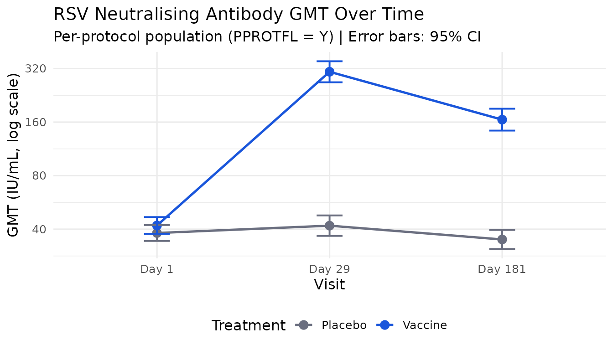
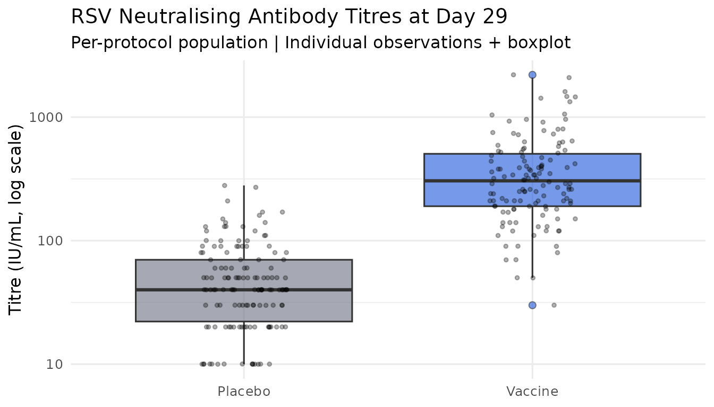

# 21 CFR Part 11-compliant vaccine immunogenicity analysis in R

## Background

Vaccine immunogenicity analyses supporting regulatory submissions are
subject to 21 CFR Part 11 requirements: every analytical decision, data
access event, and result must be traceable, time-stamped, and
tamper-evident. In practice, this means maintaining a paper audit trail
that is rarely connected to the actual analysis code — creating a gap
that regulators increasingly scrutinise.

This article demonstrates how `regulog` closes that gap. We walk through
a complete immunogenicity analysis for a simulated Phase III vaccine
trial, building a hash-chained, electronically signed audit trail
entirely within R.

The trial is a randomised, double-blind, placebo-controlled study
evaluating a novel adjuvanted subunit vaccine against respiratory
syncytial virus (RSV) in adults aged 60 years and older. The primary
immunogenicity endpoint is the geometric mean titre (GMT) ratio of
RSV-neutralising antibodies at Day 29 relative to baseline.

------------------------------------------------------------------------

## Setup

``` r

library(regulog)
library(dplyr)
```

    #> 
    #> Attaching package: 'dplyr'

    #> The following objects are masked from 'package:stats':
    #> 
    #>     filter, lag

    #> The following objects are masked from 'package:base':
    #> 
    #>     intersect, setdiff, setequal, union

``` r

library(tidyr)
library(ggplot2)
```

------------------------------------------------------------------------

## Simulate the immunogenicity dataset

We simulate a realistic CDISC ADaM-structured immunogenicity dataset
(ADIS — Subject-Level Immunogenicity Data) for 300 participants across
two treatment arms. Titres follow a log-normal distribution, consistent
with real immunogenicity data.

``` r

n_per_arm <- 150L
n_total   <- n_per_arm * 2L

# Subject-level data
adsl <- data.frame(
  STUDYID  = "RSV-VAC-301",
  USUBJID  = sprintf("RSV301-%04d", seq_len(n_total)),
  TRT01P   = rep(c("Vaccine", "Placebo"), each = n_per_arm),
  TRT01PN  = rep(c(1L, 2L), each = n_per_arm),
  AGE      = round(rnorm(n_total, mean = 68, sd = 5)),
  SEX      = sample(c("M", "F"), n_total, replace = TRUE, prob = c(0.45, 0.55)),
  SEROFL   = "Y",  # seronegative at baseline (eligible)
  ITTFL    = "Y",
  PPROTFL  = sample(c("Y", "N"), n_total, replace = TRUE, prob = c(0.94, 0.06)),
  stringsAsFactors = FALSE
)

# Immunogenicity titres — ADIS structure
visits <- data.frame(
  AVISIT  = c("Day 1",  "Day 29", "Day 181"),
  AVISITN = c(1L, 29L, 181L),
  stringsAsFactors = FALSE
)

adis <- expand.grid(
  USUBJID = adsl$USUBJID,
  AVISITN = visits$AVISITN,
  stringsAsFactors = FALSE
) |>
  merge(adsl[, c("USUBJID", "TRT01P", "ITTFL", "PPROTFL")],
        by = "USUBJID") |>
  merge(visits, by = "AVISITN") |>
  arrange(USUBJID, AVISITN)

set.seed(2026)
adis$AVAL <- NA_real_

for (i in seq_len(nrow(adis))) {
  trt <- adis$TRT01P[i]
  vis <- adis$AVISITN[i]

  baseline_log <- rnorm(1L, mean = log(40), sd = 0.6)

  adis$AVAL[i] <- if (trt == "Vaccine") {
    switch(as.character(vis),
      "1"   = exp(baseline_log),
      "29"  = exp(baseline_log + rnorm(1L, mean = log(8), sd = 0.5)),
      "181" = exp(baseline_log + rnorm(1L, mean = log(4), sd = 0.6))
    )
  } else {
    switch(as.character(vis),
      "1"   = exp(baseline_log),
      "29"  = exp(baseline_log + rnorm(1L, mean = log(1.1), sd = 0.4)),
      "181" = exp(baseline_log + rnorm(1L, mean = log(0.9), sd = 0.4))
    )
  }
}

adis$AVAL    <- pmax(10, round(adis$AVAL / 10) * 10)
adis$STUDYID <- "RSV-VAC-301"
adis$PARAM   <- "RSV Neutralising Antibody Titre (IU/mL)"
adis$PARAMCD <- "RSVNABT"

# Introduce realistic missingness (~4%)
miss_idx <- sample(nrow(adis), size = round(nrow(adis) * 0.04))
adis$AVAL[miss_idx] <- NA_real_

adis <- adis |>
  group_by(USUBJID) |>
  mutate(
    AVALOG = log2(AVAL),
    BASE   = AVAL[AVISITN == 1L][1L],
    BASLOG = log2(BASE),
    RATIO  = AVAL / BASE,
    LRATIO = log2(RATIO)
  ) |>
  ungroup()

cat(sprintf(
  "ADIS: %d rows, %d subjects, %d visits, %.1f%% missing\n",
  nrow(adis),
  n_distinct(adis$USUBJID),
  length(unique(adis$AVISITN)),
  mean(is.na(adis$AVAL)) * 100
))
```

    #> ADIS: 900 rows, 300 subjects, 3 visits, 4.0% missing

``` r

# Write to disk so rl_read()/with_log() have real files to load
tmp_adsl <- tempfile(fileext = ".csv")
tmp_adis <- tempfile(fileext = ".csv")
write.csv(adsl, tmp_adsl, row.names = FALSE)
write.csv(adis, tmp_adis, row.names = FALSE)
```

------------------------------------------------------------------------

## Initialise the audit session

[`regulog_init()`](https://reprostats.org/regulog/reference/regulog_init.md)
opens the session and writes the genesis record immediately. SAP
version, protocol, data cut, and analysis set are captured as the first
logged note.

``` r

log <- regulog_init(
  app     = "RSV-VAC-301-primary-immunogenicity",
  version = "1.0.0",
  user    = "jsmith",
  path    = file.path(tempdir(), "audit_RSV301_primary_v1.rlog")
)

log_note(log,
  "Primary immunogenicity analysis per SAP v2.0, Section 5.1. Protocol:
   RSV-VAC-301. Data cut: 2026-05-15. Analysis set: immunogenicity
   per-protocol population (PPROTFL = Y)."
)
```

    #> regulog: note logged

``` r

log
```

    #> <regulog>
    #>   App:     RSV-VAC-301-primary-immunogenicity v1.0.0
    #>   User:    jsmith
    #>   Entries: 1
    #>   Path:    /tmp/Rtmpb4im7L/audit_RSV301_primary_v1.rlog

------------------------------------------------------------------------

## Log data access

Loading ADSL and ADIS is logged automatically with
[`with_log()`](https://reprostats.org/regulog/reference/with_log.md) —
row and column counts are captured at the moment of read.

``` r

with_log(log, {
  adsl_loaded <- read(read.csv, tmp_adsl)
  adis_loaded <- read(read.csv, tmp_adis)
})
```

------------------------------------------------------------------------

## Apply analysis population

The primary immunogenicity analysis uses the per-protocol population
(PPROTFL = Y). We document the population filter and the reason for each
subject excluded.

``` r

adis_pp <- adis |> filter(PPROTFL == "Y")

n_excluded <- n_distinct(adis$USUBJID) - n_distinct(adis_pp$USUBJID)

log_action(log,
  action = "apply_pp_population",
  object = "RSV-VAC-301 per-protocol population",
  reason = sprintf(
    "Restricted to per-protocol population per SAP Section 3.2. ITT: %d subjects | PP: %d subjects | Excluded: %d (protocol deviations)",
    n_distinct(adis$USUBJID),
    n_distinct(adis_pp$USUBJID),
    n_excluded
  )
)
```

    #> regulog: logged action 'apply_pp_population' on 'RSV-VAC-301 per-protocol population'

``` r

# Log subject counts by treatment arm
arm_counts <- adis_pp |>
  filter(AVISITN == 1L) |>
  count(TRT01P)

for (i in seq_len(nrow(arm_counts))) {
  log_note(log,
    sprintf("PP population count — %s: n = %d", arm_counts$TRT01P[i], arm_counts$n[i])
  )
}
```

    #> regulog: note logged

    #> regulog: note logged

------------------------------------------------------------------------

## Handle missing titres

``` r

miss_d29 <- adis_pp |>
  filter(AVISITN == 29L, is.na(AVAL))

log_note(log,
  sprintf(
    "Missing data review — Day 29 missing titres: %d subjects (%.1f%%) — excluded from GMT analysis per SAP",
    nrow(miss_d29),
    nrow(miss_d29) / nrow(filter(adis_pp, AVISITN == 29L)) * 100
  )
)
```

    #> regulog: note logged

``` r

for (subj in miss_d29$USUBJID) {
  log_note(log,
    sprintf("Subject excluded (missing data) — USUBJID %s: Day 29 titre missing — excluded from primary analysis", subj)
  )
}
```

    #> regulog: note logged
    #> regulog: note logged
    #> regulog: note logged
    #> regulog: note logged
    #> regulog: note logged
    #> regulog: note logged
    #> regulog: note logged
    #> regulog: note logged
    #> regulog: note logged
    #> regulog: note logged

``` r

adis_primary <- adis_pp |>
  filter(AVISITN == 29L, !is.na(AVAL))

log_action(log,
  action = "define_primary_analysis_set",
  object = "RSV-VAC-301 primary analysis dataset",
  reason = sprintf(
    "Final primary analysis dataset: PP, Day 29, non-missing titre. n = %d subjects",
    nrow(adis_primary)
  )
)
```

    #> regulog: logged action 'define_primary_analysis_set' on 'RSV-VAC-301 primary analysis dataset'

------------------------------------------------------------------------

## Primary analysis: GMT and GMT ratio

The primary endpoint is the GMT ratio (Vaccine / Placebo) at Day 29.
GMTs are computed as the back-transformed mean of log2-titres.

``` r

gmt_d29 <- adis_primary |>
  group_by(TRT01P) |>
  summarise(
    n         = n(),
    gmt       = 2^mean(log2(AVAL), na.rm = TRUE),
    gmt_lo    = 2^(mean(log2(AVAL)) - qt(0.975, n() - 1) * sd(log2(AVAL)) / sqrt(n())),
    gmt_hi    = 2^(mean(log2(AVAL)) + qt(0.975, n() - 1) * sd(log2(AVAL)) / sqrt(n())),
    .groups   = "drop"
  )

log_action(log,
  action = "compute_gmt_day29",
  object = "GMT at Day 29",
  reason = sprintf(
    "Computed GMT and 95%% CI at Day 29 per SAP Section 5.1. %s",
    paste(sprintf("%s: GMT = %.1f (95%% CI: %.1f, %.1f)",
                  gmt_d29$TRT01P, gmt_d29$gmt,
                  gmt_d29$gmt_lo, gmt_d29$gmt_hi),
          collapse = " | ")
  )
)
```

    #> regulog: logged action 'compute_gmt_day29' on 'GMT at Day 29'

``` r

vac_gmt <- gmt_d29$gmt[gmt_d29$TRT01P == "Vaccine"]
pbo_gmt <- gmt_d29$gmt[gmt_d29$TRT01P == "Placebo"]
gmt_ratio <- vac_gmt / pbo_gmt

log_vac <- log2(adis_primary$AVAL[adis_primary$TRT01P == "Vaccine"])
log_pbo <- log2(adis_primary$AVAL[adis_primary$TRT01P == "Placebo"])
ttest   <- t.test(log_vac, log_pbo)

gmt_ratio_lo <- 2^(ttest$conf.int[1L])
gmt_ratio_hi <- 2^(ttest$conf.int[2L])
p_value      <- ttest$p.value

log_action(log,
  action = "compute_gmt_ratio",
  object = "GMT ratio (Vaccine/Placebo)",
  reason = sprintf(
    "Computed GMT ratio and 95%% CI per SAP Section 5.1. GMT ratio = %.2f (95%% CI: %.2f, %.2f), p %s",
    gmt_ratio, gmt_ratio_lo, gmt_ratio_hi,
    ifelse(p_value < 0.001, "< 0.001", sprintf("= %.3f", p_value))
  )
)
```

    #> regulog: logged action 'compute_gmt_ratio' on 'GMT ratio (Vaccine/Placebo)'

``` r

cat(sprintf(
  "\nGMT ratio (Vaccine / Placebo): %.2f (95%% CI: %.2f, %.2f)\np-value: %s\n",
  gmt_ratio, gmt_ratio_lo, gmt_ratio_hi,
  ifelse(p_value < 0.001, "< 0.001", sprintf("%.3f", p_value))
))
```

    #> 
    #> GMT ratio (Vaccine / Placebo): 7.33 (95% CI: 6.07, 8.86)
    #> p-value: < 0.001

------------------------------------------------------------------------

## Seroconversion analysis

A subject is a seroconverter if the Day 29 titre is \>= 4-fold the
baseline titre. We log the definition, the computation, and the result.

``` r

log_note(log,
  "Seroconversion defined as >= 4-fold rise from baseline (Day 29 / Day 1 >= 4)"
)
```

    #> regulog: note logged

``` r

adis_sc <- adis_pp |>
  filter(AVISITN == 29L, !is.na(AVAL), !is.na(BASE)) |>
  mutate(SEROCONV = as.integer(RATIO >= 4))

sc_rates <- adis_sc |>
  group_by(TRT01P) |>
  summarise(
    n          = n(),
    n_sc       = sum(SEROCONV),
    rate       = mean(SEROCONV),
    rate_lo    = prop.test(sum(SEROCONV), n())$conf.int[1L],
    rate_hi    = prop.test(sum(SEROCONV), n())$conf.int[2L],
    .groups    = "drop"
  )

log_action(log,
  action = "compute_seroconversion",
  object = "Seroconversion rates",
  reason = sprintf(
    "Computed per SAP Section 5.2. %s",
    paste(sprintf("%s: %d/%d (%.1f%%, 95%% CI: %.1f%%-%.1f%%)",
                  sc_rates$TRT01P, sc_rates$n_sc, sc_rates$n,
                  sc_rates$rate * 100,
                  sc_rates$rate_lo * 100,
                  sc_rates$rate_hi * 100),
          collapse = " | ")
  )
)
```

    #> regulog: logged action 'compute_seroconversion' on 'Seroconversion rates'

``` r

knitr::kable(sc_rates |>
  mutate(
    rate    = sprintf("%.1f%%", rate * 100),
    rate_lo = sprintf("%.1f%%", rate_lo * 100),
    rate_hi = sprintf("%.1f%%", rate_hi * 100)
  ) |>
  select(TRT01P, n, n_sc, rate, rate_lo, rate_hi),
  col.names = c("Treatment", "N", "Seroconverters",
                "Rate", "95% CI Lower", "95% CI Upper"),
  caption   = "Seroconversion rates at Day 29 (PP population)"
)
```

| Treatment |   N | Seroconverters | Rate  | 95% CI Lower | 95% CI Upper |
|:----------|----:|---------------:|:------|:-------------|:-------------|
| Placebo   | 133 |             16 | 12.0% | 7.2%         | 19.1%        |
| Vaccine   | 128 |             99 | 77.3% | 68.9%        | 84.1%        |

Seroconversion rates at Day 29 (PP population) {.table}

------------------------------------------------------------------------

## GMT persistence at Day 181

``` r

adis_d181 <- adis_pp |>
  filter(AVISITN == 181L, !is.na(AVAL))

gmt_d181 <- adis_d181 |>
  group_by(TRT01P) |>
  summarise(
    n      = n(),
    gmt    = 2^mean(log2(AVAL), na.rm = TRUE),
    gmt_lo = 2^(mean(log2(AVAL)) - qt(0.975, n() - 1) * sd(log2(AVAL)) / sqrt(n())),
    gmt_hi = 2^(mean(log2(AVAL)) + qt(0.975, n() - 1) * sd(log2(AVAL)) / sqrt(n())),
    .groups = "drop"
  )

log_action(log,
  action = "compute_gmt_day181",
  object = "GMT persistence at Day 181",
  reason = sprintf(
    "Computed GMT persistence per SAP Section 5.3 (secondary endpoint). %s",
    paste(sprintf("%s: GMT = %.1f (95%% CI: %.1f, %.1f)",
                  gmt_d181$TRT01P, gmt_d181$gmt,
                  gmt_d181$gmt_lo, gmt_d181$gmt_hi),
          collapse = " | ")
  )
)
```

    #> regulog: logged action 'compute_gmt_day181' on 'GMT persistence at Day 181'

------------------------------------------------------------------------

## Outlier review

``` r

outlier_review <- adis_primary |>
  group_by(TRT01P) |>
  mutate(
    mean_log = mean(log2(AVAL)),
    sd_log   = sd(log2(AVAL)),
    z_score  = (log2(AVAL) - mean_log) / sd_log,
    outlier  = abs(z_score) > 3
  ) |>
  ungroup()

n_outliers <- sum(outlier_review$outlier, na.rm = TRUE)

log_note(log,
  sprintf(
    "Outlier screen (|z| > 3 on log2 scale): %d flagged — retained per SAP (no clinical basis for exclusion; sensitivity analysis planned)",
    n_outliers
  )
)
```

    #> regulog: note logged

``` r

if (n_outliers > 0L) {
  for (subj in outlier_review$USUBJID[outlier_review$outlier]) {
    z <- outlier_review$z_score[outlier_review$USUBJID == subj]
    log_note(log,
      sprintf("Outlier flagged — USUBJID %s: z = %.2f — retained, flagged for sensitivity", subj, z)
    )
  }
}
```

------------------------------------------------------------------------

## Visualisations

``` r

gmt_time <- adis_pp |>
  filter(!is.na(AVAL)) |>
  group_by(TRT01P, AVISITN, AVISIT) |>
  summarise(
    gmt    = 2^mean(log2(AVAL)),
    gmt_lo = 2^(mean(log2(AVAL)) - qt(0.975, n() - 1) * sd(log2(AVAL)) / sqrt(n())),
    gmt_hi = 2^(mean(log2(AVAL)) + qt(0.975, n() - 1) * sd(log2(AVAL)) / sqrt(n())),
    .groups = "drop"
  ) |>
  mutate(AVISIT = factor(AVISIT, levels = c("Day 1", "Day 29", "Day 181")))

ggplot(gmt_time, aes(x = AVISIT, y = gmt, colour = TRT01P, group = TRT01P)) +
  geom_line(linewidth = 0.9) +
  geom_point(size = 3) +
  geom_errorbar(aes(ymin = gmt_lo, ymax = gmt_hi), width = 0.15, linewidth = 0.7) +
  scale_y_log10(breaks = c(20, 40, 80, 160, 320, 640)) +
  scale_colour_manual(values = c("Vaccine" = "#1a56db", "Placebo" = "#6b6f80")) +
  labs(
    title    = "RSV Neutralising Antibody GMT Over Time",
    subtitle = "Per-protocol population (PPROTFL = Y) | Error bars: 95% CI",
    x        = "Visit",
    y        = "GMT (IU/mL, log scale)",
    colour   = "Treatment"
  ) +
  theme_minimal(base_size = 12) +
  theme(legend.position = "bottom")
```



``` r

log_note(log, "Figure generated: GMT over time by treatment arm (PP population)")
```

    #> regulog: note logged

``` r

adis_primary |>
  ggplot(aes(x = TRT01P, y = AVAL, fill = TRT01P)) +
  geom_boxplot(alpha = 0.6, outlier.shape = 21, outlier.size = 2) +
  geom_jitter(width = 0.15, alpha = 0.3, size = 1) +
  scale_y_log10() +
  scale_fill_manual(values = c("Vaccine" = "#1a56db", "Placebo" = "#6b6f80")) +
  labs(
    title    = "RSV Neutralising Antibody Titres at Day 29",
    subtitle = "Per-protocol population | Individual observations + boxplot",
    x        = NULL,
    y        = "Titre (IU/mL, log scale)",
    fill     = "Treatment"
  ) +
  theme_minimal(base_size = 12) +
  theme(legend.position = "none")
```



``` r

log_note(log, "Figure generated: individual titre distribution at Day 29 (PP population)")
```

    #> regulog: note logged

------------------------------------------------------------------------

## Results summary

``` r

results <- data.frame(
  Endpoint = c(
    "GMT at Day 29 — Vaccine",
    "GMT at Day 29 — Placebo",
    "GMT Ratio (Vaccine/Placebo)",
    "Seroconversion Rate — Vaccine",
    "Seroconversion Rate — Placebo",
    "GMT at Day 181 — Vaccine",
    "GMT at Day 181 — Placebo"
  ),
  Result = c(
    sprintf("%.1f (%.1f, %.1f)", vac_gmt,
            gmt_d29$gmt_lo[gmt_d29$TRT01P == "Vaccine"],
            gmt_d29$gmt_hi[gmt_d29$TRT01P == "Vaccine"]),
    sprintf("%.1f (%.1f, %.1f)", pbo_gmt,
            gmt_d29$gmt_lo[gmt_d29$TRT01P == "Placebo"],
            gmt_d29$gmt_hi[gmt_d29$TRT01P == "Placebo"]),
    sprintf("%.2f (%.2f, %.2f)", gmt_ratio, gmt_ratio_lo, gmt_ratio_hi),
    sprintf("%.1f%% (%.1f%%, %.1f%%)",
            sc_rates$rate[sc_rates$TRT01P == "Vaccine"] * 100,
            sc_rates$rate_lo[sc_rates$TRT01P == "Vaccine"] * 100,
            sc_rates$rate_hi[sc_rates$TRT01P == "Vaccine"] * 100),
    sprintf("%.1f%% (%.1f%%, %.1f%%)",
            sc_rates$rate[sc_rates$TRT01P == "Placebo"] * 100,
            sc_rates$rate_lo[sc_rates$TRT01P == "Placebo"] * 100,
            sc_rates$rate_hi[sc_rates$TRT01P == "Placebo"] * 100),
    sprintf("%.1f (%.1f, %.1f)",
            gmt_d181$gmt[gmt_d181$TRT01P == "Vaccine"],
            gmt_d181$gmt_lo[gmt_d181$TRT01P == "Vaccine"],
            gmt_d181$gmt_hi[gmt_d181$TRT01P == "Vaccine"]),
    sprintf("%.1f (%.1f, %.1f)",
            gmt_d181$gmt[gmt_d181$TRT01P == "Placebo"],
            gmt_d181$gmt_lo[gmt_d181$TRT01P == "Placebo"],
            gmt_d181$gmt_hi[gmt_d181$TRT01P == "Placebo"])
  ),
  stringsAsFactors = FALSE
)

knitr::kable(results,
  col.names = c("Endpoint", "Estimate (95% CI)"),
  caption   = "Immunogenicity results summary — RSV-VAC-301 (PP population)"
)
```

| Endpoint                      | Estimate (95% CI)    |
|:------------------------------|:---------------------|
| GMT at Day 29 — Vaccine       | 307.0 (267.9, 351.7) |
| GMT at Day 29 — Placebo       | 41.9 (36.7, 47.8)    |
| GMT Ratio (Vaccine/Placebo)   | 7.33 (6.07, 8.86)    |
| Seroconversion Rate — Vaccine | 77.3% (68.9%, 84.1%) |
| Seroconversion Rate — Placebo | 12.0% (7.2%, 19.1%)  |
| GMT at Day 181 — Vaccine      | 165.2 (143.4, 190.3) |
| GMT at Day 181 — Placebo      | 35.0 (31.0, 39.6)    |

Immunogenicity results summary — RSV-VAC-301 (PP population) {.table}

``` r

log_action(log,
  action = "results_compiled",
  object = "Final immunogenicity results table",
  reason = sprintf(
    "Primary endpoint: GMT ratio = %.2f (%.2f, %.2f), p %s — %s pre-specified criterion",
    gmt_ratio, gmt_ratio_lo, gmt_ratio_hi,
    ifelse(p_value < 0.001, "< 0.001", sprintf("%.3f", p_value)),
    ifelse(gmt_ratio_lo > 2.0, "MEETS", "DOES NOT MEET")
  )
)
```

    #> regulog: logged action 'results_compiled' on 'Final immunogenicity results table'

------------------------------------------------------------------------

## Electronic sign-off

Under 21 CFR Part 11, electronic signatures must include the signatory’s
name, the date and time, and the meaning of the signature.
[`log_signature()`](https://reprostats.org/regulog/reference/log_signature.md)
implements this — the signer identity is resolved automatically from the
session `user` set at
[`regulog_init()`](https://reprostats.org/regulog/reference/regulog_init.md)
and cannot be overridden, and the number of entries covered is captured
automatically.

``` r

log_signature(log,
  "I confirm that this analysis was conducted in accordance with SAP v2.0
   and that the results presented are accurate and complete to the best
   of my knowledge."
)
```

    #> regulog: signature applied by 'jsmith' covering 27 entries

------------------------------------------------------------------------

## Verify the audit chain

[`verify_log()`](https://reprostats.org/regulog/reference/verify_log.md)
recomputes the SHA-256 hash chain from the first entry to the last. Any
post-hoc modification to any entry breaks the chain and is immediately
detectable.

``` r

verify_log(log)
```

    #> regulog: Log intact: 28 entries, chain unbroken

------------------------------------------------------------------------

## Export the audit trail

``` r

trail <- export_audit_trail(log,
  format = "csv",
  signed = TRUE,
  path   = file.path(tempdir(), "audit_trail_RSV301_primary_v1.csv")
)
```

    #> regulog: exported 28 row(s) to /tmp/Rtmpb4im7L/audit_trail_RSV301_primary_v1.csv

``` r

# Preview the audit trail
filter_log(log) |>
  head(10L) |>
  select(timestamp, type, action, reason) |>
  knitr::kable(caption = "Audit trail — first 10 entries")
```

| timestamp | type | action | reason |
|:---|:---|:---|:---|
| 2026-06-30T19:02:37.731898Z | NOTE | note | Primary immunogenicity analysis per SAP v2.0, Section 5.1. Protocol: |

Audit trail — first 10 entries {.table}

RSV-VAC-301. Data cut: 2026-05-15. Analysis set: immunogenicity
per-protocol population (PPROTFL = Y). \| \|2026-06-30T19:02:37.792804Z
\|ACTION \|data_read \|read.csv(“/tmp/Rtmpb4im7L/file1c4c1fca1244.csv”)
— 300 rows, 9 cols \| \|2026-06-30T19:02:37.797492Z \|ACTION \|data_read
\|read.csv(“/tmp/Rtmpb4im7L/file1c4c71d2b523.csv”) — 900 rows, 15 cols
\| \|2026-06-30T19:02:37.858907Z \|ACTION \|apply_pp_population
\|Restricted to per-protocol population per SAP Section 3.2. ITT: 300
subjects \| PP: 278 subjects \| Excluded: 22 (protocol deviations) \|
\|2026-06-30T19:02:37.872012Z \|NOTE \|note \|PP population count —
Placebo: n = 140 \| \|2026-06-30T19:02:37.873270Z \|NOTE \|note \|PP
population count — Vaccine: n = 138 \| \|2026-06-30T19:02:37.935914Z
\|NOTE \|note \|Missing data review — Day 29 missing titres: 10 subjects
(3.6%) — excluded from GMT analysis per SAP \|
\|2026-06-30T19:02:37.939926Z \|NOTE \|note \|Subject excluded (missing
data) — USUBJID RSV301-0011: Day 29 titre missing — excluded from
primary analysis \| \|2026-06-30T19:02:37.941145Z \|NOTE \|note
\|Subject excluded (missing data) — USUBJID RSV301-0025: Day 29 titre
missing — excluded from primary analysis \|
\|2026-06-30T19:02:37.942283Z \|NOTE \|note \|Subject excluded (missing
data) — USUBJID RSV301-0052: Day 29 titre missing — excluded from
primary analysis \|

------------------------------------------------------------------------

## What the audit trail proves

The exported CSV provides a complete, tamper-evident record of:

- **Who** ran the analysis (analyst identity, electronic sign-off)
- **When** every step was executed (UTC timestamps)
- **What** data were loaded and from where, with row and column counts
  captured at read time
- **Why** every decision was made (mandatory reason fields)
- **What** subjects were excluded and why
- **What** outliers were flagged and what decision was taken
- **What** results were produced

Any modification to the CSV after export will break the SHA-256 hash
chain, which
[`verify_log()`](https://reprostats.org/regulog/reference/verify_log.md)
will detect — satisfying the tamper-evidence requirement of 21 CFR Part
11 §11.10(e) and EU Annex 11 Clause 9.

------------------------------------------------------------------------

## Session information

``` r

sessionInfo()
```

    #> R version 4.6.1 (2026-06-24)
    #> Platform: x86_64-pc-linux-gnu
    #> Running under: Ubuntu 24.04.4 LTS
    #> 
    #> Matrix products: default
    #> BLAS:   /usr/lib/x86_64-linux-gnu/openblas-pthread/libblas.so.3 
    #> LAPACK: /usr/lib/x86_64-linux-gnu/openblas-pthread/libopenblasp-r0.3.26.so;  LAPACK version 3.12.0
    #> 
    #> locale:
    #>  [1] LC_CTYPE=C.UTF-8       LC_NUMERIC=C           LC_TIME=C.UTF-8       
    #>  [4] LC_COLLATE=C.UTF-8     LC_MONETARY=C.UTF-8    LC_MESSAGES=C.UTF-8   
    #>  [7] LC_PAPER=C.UTF-8       LC_NAME=C              LC_ADDRESS=C          
    #> [10] LC_TELEPHONE=C         LC_MEASUREMENT=C.UTF-8 LC_IDENTIFICATION=C   
    #> 
    #> time zone: UTC
    #> tzcode source: system (glibc)
    #> 
    #> attached base packages:
    #> [1] stats     graphics  grDevices utils     datasets  methods   base     
    #> 
    #> other attached packages:
    #> [1] ggplot2_4.0.3 tidyr_1.3.2   dplyr_1.2.1   regulog_0.2.0
    #> 
    #> loaded via a namespace (and not attached):
    #>  [1] gtable_0.3.6       jsonlite_2.0.0     compiler_4.6.1     tidyselect_1.2.1  
    #>  [5] jquerylib_0.1.4    systemfonts_1.3.2  scales_1.4.0       textshaping_1.0.5 
    #>  [9] yaml_2.3.12        fastmap_1.2.0      R6_2.6.1           generics_0.1.4    
    #> [13] knitr_1.51         tibble_3.3.1       desc_1.4.3         bslib_0.11.0      
    #> [17] pillar_1.11.1      RColorBrewer_1.1-3 rlang_1.2.0        cachem_1.1.0      
    #> [21] xfun_0.59          S7_0.2.2           fs_2.1.0           sass_0.4.10       
    #> [25] otel_0.2.0         cli_3.6.6          withr_3.0.3        pkgdown_2.2.0     
    #> [29] magrittr_2.0.5     digest_0.6.39      grid_4.6.1         lifecycle_1.0.5   
    #> [33] vctrs_0.7.3        evaluate_1.0.5     glue_1.8.1         farver_2.1.2      
    #> [37] ragg_1.5.2         rmarkdown_2.31     purrr_1.2.2        tools_4.6.1       
    #> [41] pkgconfig_2.0.3    htmltools_0.5.9
